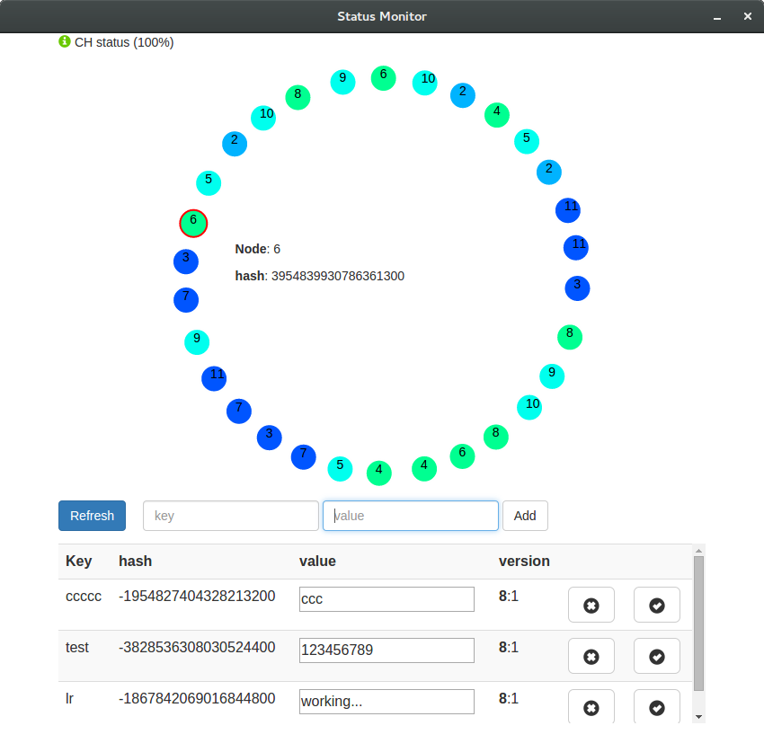

# PAD-project

The aim of the project is to create a weakly consistent distributed file system by using gossiping, consistent hashing and vector clocks.

This is the project of the Distributed Enabling Platforms course and [here](./REPORT.pdf) can be found the report.

[Here](http://lucarin91.github.io/PAD-project) find the slides that presents the PAD-FS project.

<!-- TOC depthFrom:2 depthTo:6 withLinks:1 updateOnSave:1 orderedList:0 -->

- [Introduction](#introduction)
- [User Guide](#user-guide)
	- [Thread version](#thread-version)
	- [Single server version](#single-server-version)
	- [Docker version](#docker-version)
	- [MonitorWebApp](#monitorwebapp)
- [References](#references)
	- [Java libraries:](#java-libraries)
	- [Nodejs and javascript libraries:](#nodejs-and-javascript-libraries)
	- [Build tools:](#build-tools)
	- [Docker images:](#docker-images)

<!-- /TOC -->

## Introduction
The communication between nodes exploits the Java socket mechanism, thus it can be executed in different ways: on a single machine with threads, on a cluster of servers or in virtual containers using *Docker*.


The file system is implemented as a key value map of type *<string, string U number>* with the following operations:

- **add**(key, value) that adds the pair only if the key is not present;
- **get**(key) returning the value of the key if present;
- **update**(key, value) that updates the key with the new value only if the key already exists;
- **remove**(key) that removes the key if present;


## User Guide
The simplest way to use the file system is to download the last release and run it with the only requirement of Java8. In this way, the application can be used either in the multi-thread version with the `app-<version>.jar` or in the cluster version with the storage node `core-<version>.jar` and the front node `api-<version>.jar`.
In the release is also possible to find the the MonitorWebApp for Linux, MacOS and Windows.


**Requirements**:

- Java8
- *Nodejs/npm (optional only for the MonitorWebApp)*
- *Docker>=10 (optional only for the Docker version of the file system)*


### Thread version
It can be built with:
```bash
./gradlew app:build
```
and run with:
```bash
java -jar app-<version>.jar
```
Optional parameters:

- `-N <number>` number of servers to start
- `-n <number>` number of seeds servers
- `-gport <number>` the port number used by the gossip protocol
- `-mport <number>` the port number of the management server

example:

```bash
java -jar -N 10 -n 2 -gport 3000 -mport 2000
```

### Single server version
It can be built with:
```bash
./gradlew core:build api:build
```

To start a storage node run:
```bash
./java -jar core-<version>.jar
```

To start a front server run:
```bash
./java -jar api-<version>.jar
```

optional parameters:

- `-id <string>` the port of the server
- `-ip <string>` the ip of the server
- `-p <number>` the port of the server (two successive port are used)
- `-m <id>:<ip>:<port>` a seed server to start the gossip protocol (use this parameters for each seed server)
- `-h <id>:<ip>:<port>` all the server configuration as a single string

example:
```bash
./java -jar core-<version>.jar \
    -h server1:192.0.0.5:2000 -m server2:192.0.0.2 -m server3:192.0.0.3
```

### Docker version
To build the docker image of the front node and the storage node run
```bash
./gradlew core:build core:docker api:build api:docker
```

Now is possible to execute a demo by running the following Perl script:
```bash
perl start-docker.pl <number of storage node :default 5>
```

To manually run a file system node you have to create a new docker network with the command:

```bash
docker network create --subnet=172.18.0.1/16 fs-net
```
then to start a two node file system
```bash
docker run -d \
    --net fs-net \
    --ip 172.18.0.1 pad-fs/core:0.1 \
    -h server1:172.18.0.1:2000

docker run -d \
    --net fs-net \
    --ip 172.18.0.2 pad-fs/core:0.1 \
    -h server2:172.18.0.2:2000  -m server1:172.18.0.1:2000
```

and a front end node with
```bash
docker run -d \
    -p 8080:8080 \
    --net fs-net \
    --ip 172.18.0.20 pad-fs/api:0.1 \
    -h rest:172.18.0.20:2000 -m server2:172.18.0.2:2000
```

### MonitorWebApp


The web-app can be used with one of the released versions for the different OS's or run with the Node.js interpreter with the following command:

```bash
./gradlew webapp:run
```

## References
### Java libraries

- [edwardcapriolo/gossip](https://github.com/edwardcapriolo/gossip),to implement the gossip protocol between the servers.
- [MapDB](http://www.mapdb.org/), to implement the persistent storage.
- [FasterXML/jackson](https://github.com/FasterXML/jackson), to easily convert Java class to JSON.
- [JUnit](http://junit.org/), to the test the project.
- [Spring](https://spring.io/), to implement the restful API.
- [JCommander](http://jcommander.org/), to parse the argument given to the programs.
- [Log4j](http://logging.apache.org/log4j/2.x/), to manage the log system of the project.


### Nodejs and javascript libraries

- [AngularJS](https://angularjs.org/), to implement the one page site of the MonitorWebApp.
- [Bootstrap](http://getbootstrap.com/), for he graphics of the MonitorWebApp.
- [NW.js](http://nwjs.io/), to transform the webapp to a native app for Mac Windows an Linux.


### Build tools

- [Gradle](https://gradle.org/), to build all the project and manage the dependencies.
- [gradle-docker](https://github.com/Transmode/gradle-docker),the docker plug-in for Gradle.
- [JitPack](https://jitpack.io), to build Java library from github.
- [npm](https://www.npmjs.com/), to manage the dependency of MonitorWebApp.
- [nw-builder](https://github.com/nwjs/nw-builder) to build MonitorWebApp for the different operation system.


### Docker images

- [java](https://hub.docker.com/_/java/) a Docker image with the openJDK.
