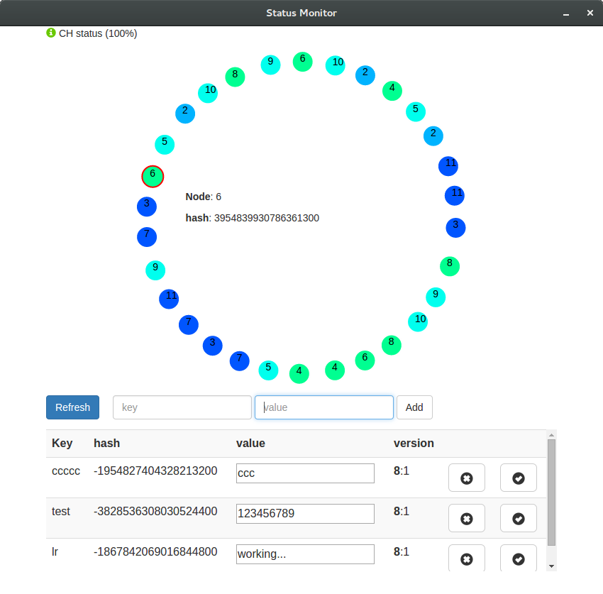

# PAD-project
The aim of the project is to create weak consistency distributed filesystem in java, with the use of gossiping, consistent hashing and vector clocks.

The project use the java socket mechanism to work and so it can be executed in different way: on a single machine with the use of threads, on a cluster of server or by using docker containers.

The file-system is implemented as a map with a string key and a number or string value, the implemented operation are:
- **add**(key, value), add only if not present
- **get**(key), get the value of the key if present
- **update**(key, value), update the key with the new value only if the key is already present
- **remove**(key), remove the key if present

## Logical Structure
The file-system is composed by two fundamental parts the front-end, that provide the external access to the file-system through a Restful json API, and the storage node where the actual data are stored.


### Communication system
All the internal communication is done with the java `DatagramSocket`, that use the UDP transport packet. All the node either the front end one that the storage server use the gossip protocol to update the list of the server involved in the file-system.
When a new request arrive to a front node is randomly extract a node from is list and send the request to it.

### Storage protocol
All the storage node manage a consistent hash table and use assign the data to be store to the correct server, in the following way:
- a server is master of all the data with an hash lower or equal of its.
- each data is replicated to a fixed number of server that have the hash greater of the one of the master

The system use a single master storage protocol without consensus, so the data are write or read without wait the server that have the backup version of the data.

When a new server arrive the server with a greater hash give all his data with a the hash lower or equal the one of the new server.

Within the data there are also add a vector clock to have a trace of the version of the date. The vector clock is implemented with a map server is and counter, and if a key is not present it is consider zero.
Each time a server update a date as a master it increment the counter with his id inside the object.
This vector clock of a data is used every time two version of it are founded, after some key management, and use in such a way if possible to determine the newer version  is maintained. If two unconfrontable version of the data are founded the node server keep the one with more entry in the map,this because is more probable that a key that is updated more time is newer.

## Project Structure
The system is structured in the following projects:
- **core**, it represent a single storage node with all the structure and the essential algorithm to work.
- **api**, this is a single front end node
- **app**, it implement a distributed file system with a single API server, where each node is represented by a thread.
- **webapp**, this is a nodejs application that graphically show the state of the FS.


### Core
The main class in the project are:
- **Messages**, and his children class (MessageManage, MessageRequest<T>, MessageResponse<T>, MessageStatus) they rapppresent a json message exchanged between the FS nodes.
- **ConsistentHash**, the implement of a Consistent hash table own by each storage nodes
- **Data<T>**, it represent a generic data saved inside the system
- **Node**, a generic server node of the system either a front-end or a backend server.
- **NodeService**, it is a storage node object
- **PersistentStorage**, a wrapper for the MapDB library used to permanentlly store data on the service node
-  **VectorClock**, the implementation of the vector clock used by each data

#### Node class
The node class represent a server of the file system with the id the ip and the port of either the gossip server and the management service. It also expose a send(Message msg) method to send to it a new message with the DatragramSocket.

This class is extended by the NodeService and the GossipResurce witch implemment a storage node and a front-end node.

The NodeService can be instancieted with the contructur `NodeService(String id_, String ipAddress, int port, List<GossipMember> gossipMembers)` that inizializete all the needed structure as:
- PersistentStorage class
- DatagramSocketServer with use to receive message from the other node
- ConsistentHash class,
- GossipService to mantein the CH structured

Each NodeService use two port to work, one for the GossipServcer and trhe other to wait to messages from the other node. If not specified the service take two consecutive port.  


### Api
The rest api, implemented with Spring web framework, expose the end point `/api` and `/status`. The first is a the public file-system entry-point to operate with the file-system. The second is a monitoring tool that get a snapshot of all the node present in the file-system.

The following operation can be used on the `/api` resources:
- get a key, method: `GET`, parameter: `key=<name>`
- add a key, method: `POST`, body: `{"key": "..", "value": ".."}`
- update a key, method: `PUT`, body `{"key": "..", "value": ".."}`
- delete a key, method: `DEL`, parameter: `key=<name>`


## How use it
### Requirements
- **java8**
- nodejs/npm (optional only for the management tools)
- docker>=10 (optional only for the docker version of the file-system)

### Thread version
```
./gradlew app:run
```
if you want also to start also the management tools run
```
./graadlew webapp:run app:run
```

optional parameters (you can pass to gradle by `-Dexec.args="<parameters>"`):
- `-N <number>` number of servers to start
- `-n <number>` number of seeds servers
- `-gport <number>` the port number used by the gossip protocol
- `-mport <number>` the port number of the management server

example:
```
./gradlew webapp:run app:run -Dexec.args="-N 10 -n 2 -gport 3000 -mport 2000"
```

### Single server
to start a storage server run
```
./gradlew core:run
```
to start a front server run
```
./gradlew api:run
```

optional parameters (you can pass to gradle by `-Dexec.args="<parameters>"`):
- `-id <string>` the port of the server
- `-ip <string>` the ip of the server
- `-p <number>` the port of the server (two successive port are used)
- `-m <id>:<ip>:<port>` a seed server to start the gossip protocol (use this parameters for each seed server)
- `-h <id>:<ip>:<port>` all the server configuration as a single string

example:
```
./gradlew core:run -Dexec.args="-h server1:192.0.0.5:2000 -m server2:192.0.0.2 -m server3:192.0.0.3"
```

### Docker version
to build the docker image of the front node and the storage node run
```
./gradlew core:build core:docker api:build api:docker
```

Now is possible to execute a demo by run the following perl script:
```
perl start-docker.pl <number of storage node :default 5>
```

To manually run a filesystem node you have to create a new docker network with the command:
```
docker network create --subnet=172.18.0.1/16 fs-net
```
then to start a two node file system run
```
docker run -d --net fs-net --ip 172.18.0.1 pad-fs/core:0.1 -h server1:172.18.0.1:2000
docker run -d --net fs-net --ip 172.18.0.2 pad-fs/core:0.1 -h server2:172.18.0.2:2000  -m server1:172.18.0.1:2000

```
and a front end node with
```
docker run -d -p 8080:8080 --net fs-net --ip 172.18.0.20 pad-fs/api:0.1 -h rest:172.18.0.20:2000 -m server2:172.18.0.2:2000
```
now you can also start the management app with:
```
./gradlew webapp:run
```
