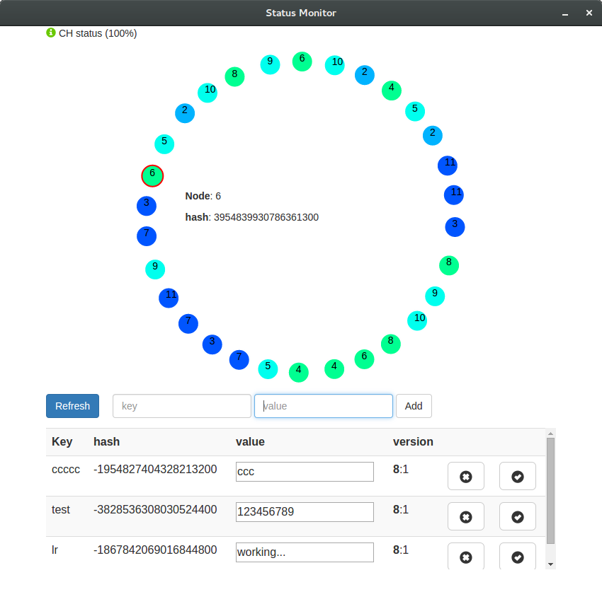

# PAD-FS
#### A distributed persistent data storage

<small>Created by <a href="http://www.github.com/lucarin91">Luca Rinaldi</a></small>

### Characteristics:

- weak consistency  
<!-- .element: class="fragment" -->

- dynamic number of servers
<!-- .element: class="fragment" -->

- replication on multiple servers
<!-- .element: class="fragment" -->

- RESTful API to interact
<!-- .element: class="fragment" -->

- MonitorApp to manage the whole file system
<!-- .element: class="fragment" -->

- data versing and data conflict resolution
<!-- .element: class="fragment" -->

#### Can executed (da ragionare)
- multithreaded version
- multiserver version
- multiconteiner version (with Docker)

### Structure

Note: Two type of server one for the storage and one for the user interaction

#### MonitorApp

### Storage Protocol

consistent hashing for key dristibution
<!-- .element: class="fragment" -->

single master without consensus
<!-- .element: class="fragment" -->

data replication among servers
<!-- .element: class="fragment" -->

versioning to manage conflicts
<!-- .element: class="fragment" -->

#### Operation avaible:

- `add(key, value)`
- `get(key)`
- `update(key)`
- `delete(key)`

#### Conflict resolution

Note: the conlict data is t

### Project Structure

- core
- api
- app
- webapp

### Test Coverage

| Class    	  | %	Method        | %	Line           |
|-------------|-----------------|------------------|
| GossipResource		| 90% (9/ 10)	| 70% (42/ 60) |
| Node             |	94.4% (17/ 18) | 92.2% (59/ 64) |
| StorageNode	     |  92.9% (13/ 14) | 83.9% (135/ 161) |
| ConsistentHash	 |  68.2% (15/ 22) | 82.9% (58/ 70) |
| Data	| 95.5% (21/ 22)	| 98.4% (60/ 61) |
| PersistentStorage	| 83.3% (10/ 12) | 79.7% (47/ 59) |
| VectorClock	| 86.7% (13/ 15)	| 86.1% (31/ 36) |
| Message	| 100% (6/ 6)	| 100% (9/ 9) |
| MessageManage	|	100% (10/ 10)	| 100% (21/ 21) |
| MessageRequest	| 92.3% (12/ 13)	| 90.9% (30/ 33) |
| MessageResponse	| 90% (9/ 10)	| 81% (17/ 21) |
| MessageStatus	| 0% (0/ 8) | 	0% (0/ 16) |
<!-- .element: style="font-size:20px" -->

### More details
find the code [here](https://github.com/lucarin91/PAD-project)

or read more [here](https://github.com/lucarin91/PAD-project/blob/master/REPORT.pdf)
